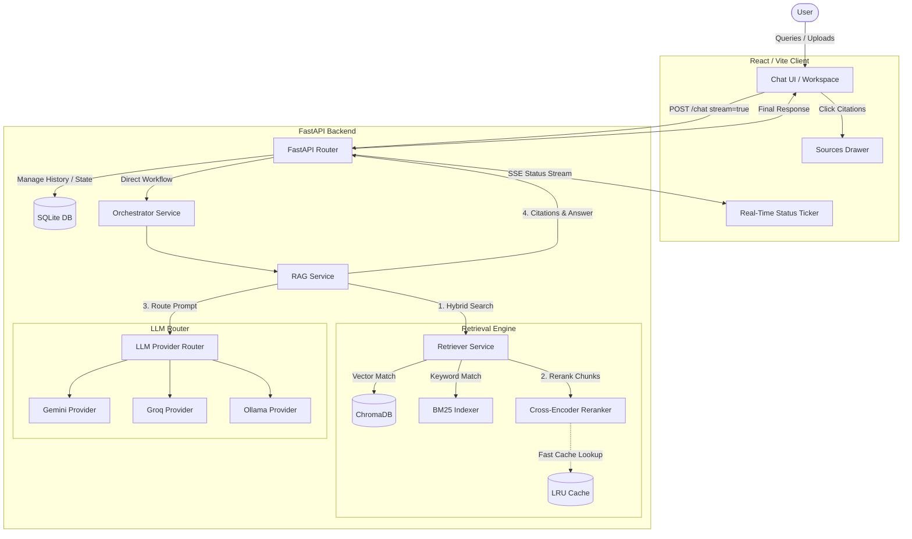
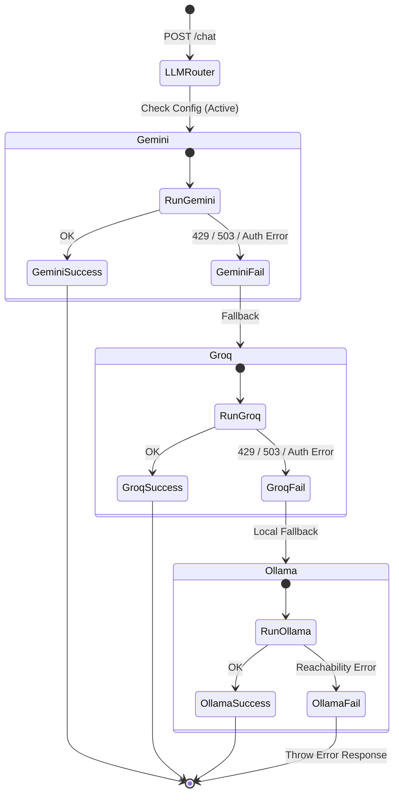
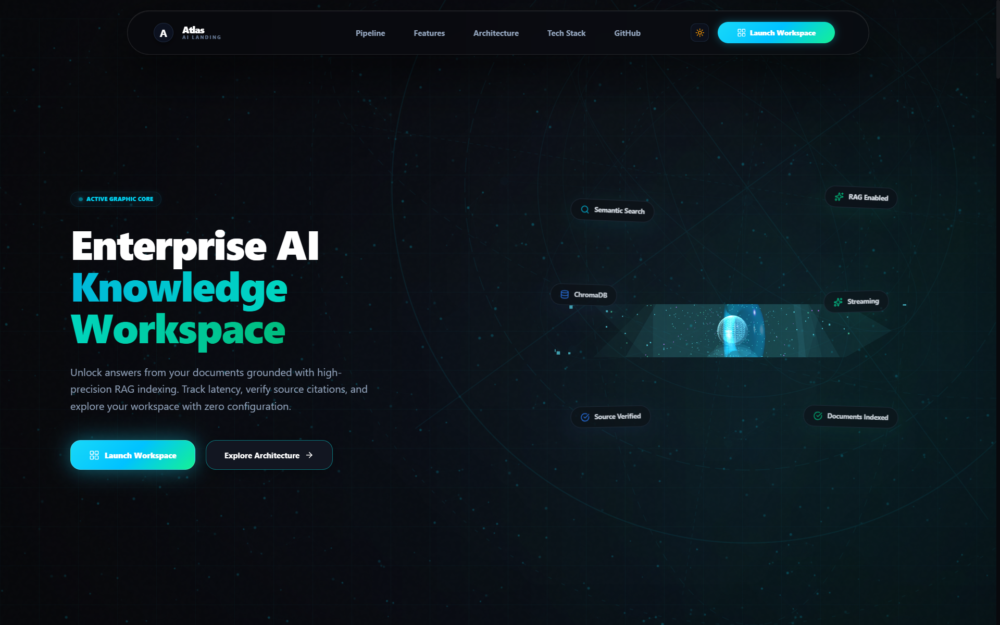
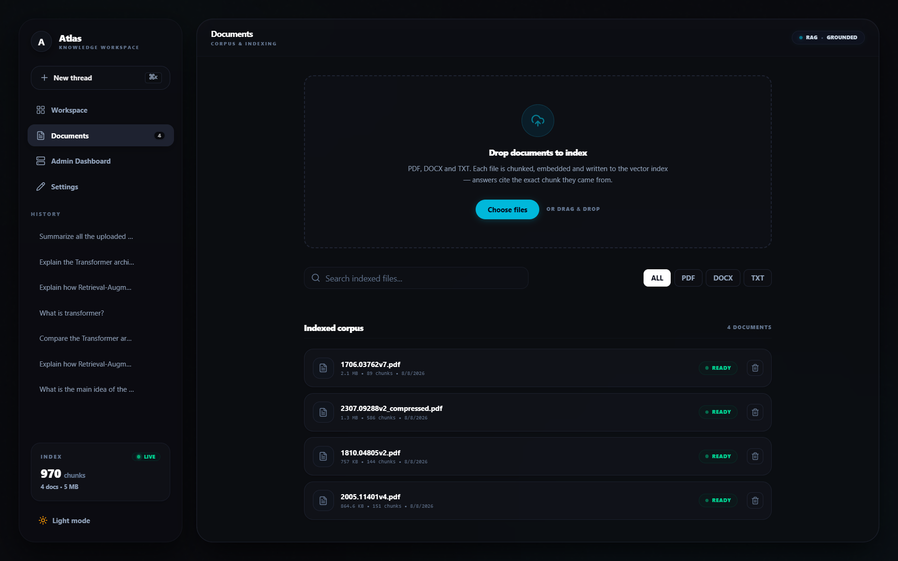
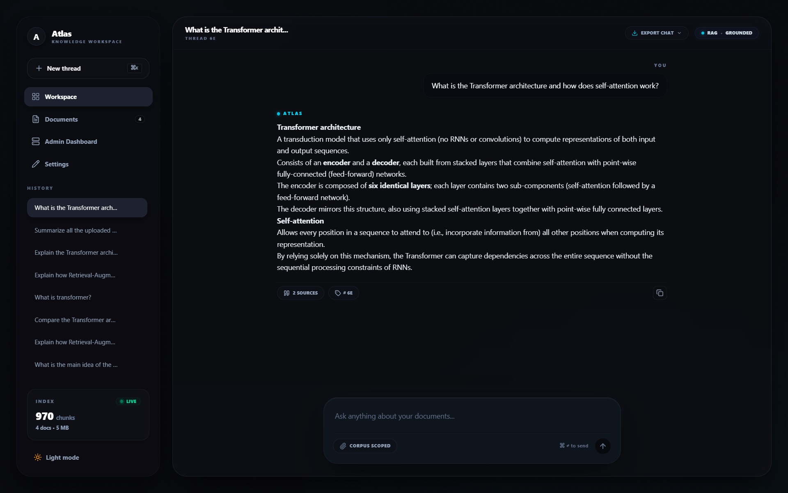
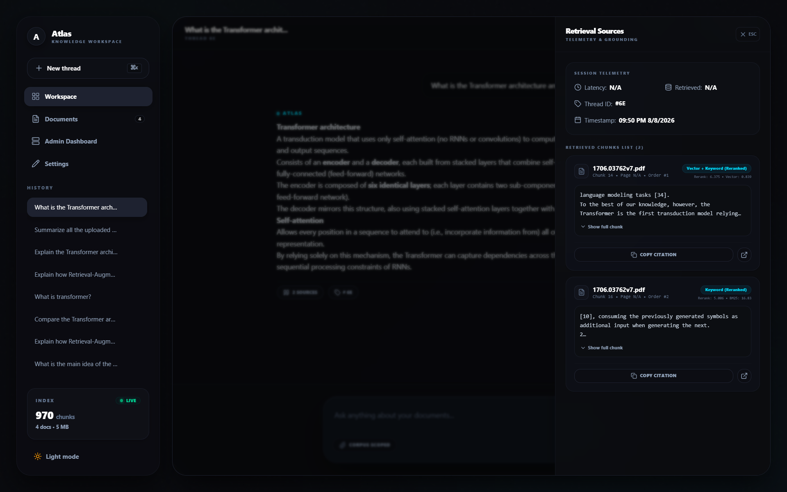
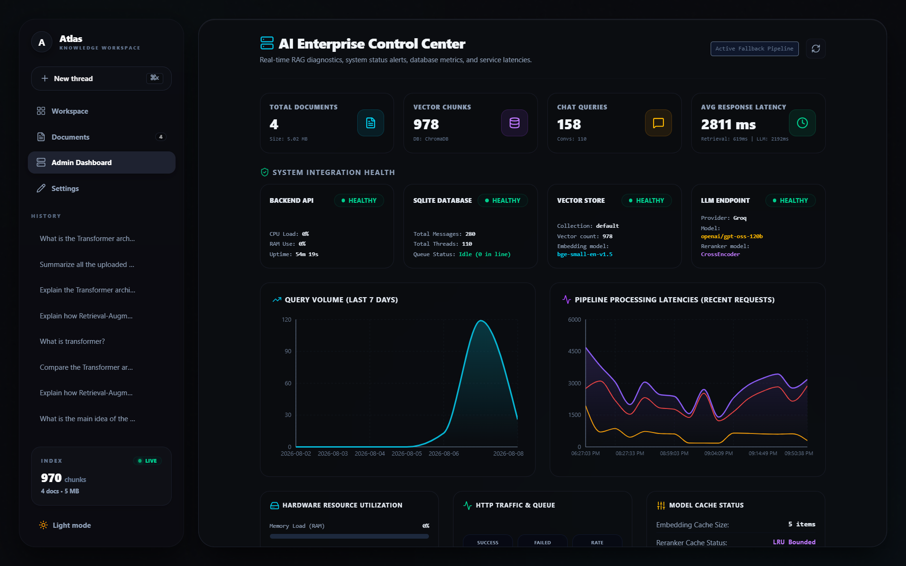
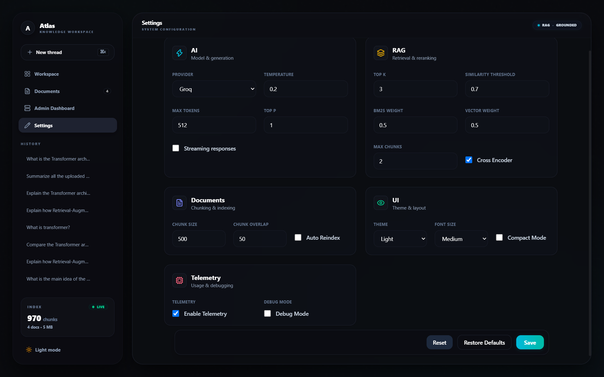
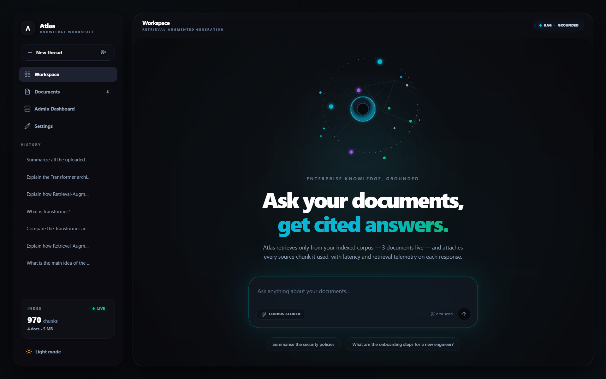

# Atlas — AI Knowledge Chatbot

> A retrieval-augmented generation (RAG) workspace for asking questions over uploaded documents. Featuring hybrid search, cross-encoder reranking, source citations, conversation history, real-time pipeline status telemetry, and configuration controls.

---


---

## Why Atlas?

Atlas is an engineering-focused document intelligence system rather than a simple LLM chat wrapper. It features a complete RAG pipeline that extracts text from documents, chunks them using token-aware recursive boundaries, embeds them locally, runs hybrid lexical-semantic searches, reranks results using a local Cross-Encoder model, and streams grounded answers with transparent citations.

### Key Capabilities
*   **Multi-Format Parser:** Support for PDF, DOCX, and TXT files.
*   **Idempotent Ingestion:** Safe background indexing via FastAPI `BackgroundTasks` with automatic startup indexing recovery.
*   **Hybrid Search:** Cosine vector similarity interleaved with a custom BM25 keyword index.
*   **Cross-Encoder Reranking:** Re-scores candidates using `ms-marco-MiniLM-L-6-v2`.
*   **Fault-Tolerant Routing:** Sequentially routes generation requests across Groq, Gemini, and Ollama.
*   **Telemetry Observability:** Track latencies, resource usages, health checks, and metrics from a dedicated Admin Dashboard.
*   **Pre-Inference Caching:** Bounded query embedding and pair scoring caches bypass inference for repeated operations.

---

## Quick Navigation
*   [System Architecture](#1-system-architecture)
*   [RAG Pipeline Details](#2-rag-pipeline-details)
*   [LLM Provider Routing](#3-llm-provider-routing)
*   [Database & History Configuration](#4-database--history-configuration)
*   [Tech Stack](#5-tech-stack)
*   [Project Structure](#6-project-structure)
*   [Local Setup](#7-local-setup)
*   [Docker Deployment](#8-docker-deployment)
*   [API Documentation](#9-api-documentation)
*   [Testing Suite](#10-testing-suite)
*   [Security Measures](#11-security-measures)
*   [Error & Grounding Safeguards](#12-error--grounding-safeguards)
*   [Screenshots & UI Walkthrough](#13-screenshots--ui-walkthrough)
*   [SSS Assessment Requirement Mapping](#14-sss-assessment-requirement-mapping)
*   [Core Engineering Decisions](#15-core-engineering-decisions)
*   [Known Limitations & Future Improvements](#16-known-limitations--future-improvements)

---

## 1. System Architecture

The following diagram outlines the complete system data flow:



---

## 2. RAG Pipeline Details

### 2.1 Ingestion & Chunking
*   **Extraction:** PDF files are extracted using `pypdf`, Word files via `python-docx`, and text files via standard file streams.
*   **Chunking:** `RecursiveCharacterTextSplitter` segments text into overlapping windows (default 500 characters, 50 characters overlap) to preserve context.
*   **Database Sync:** Document metadata is stored in SQLite (marked as `PROCESSING`). Background tasks perform chunk indexing, updating the status to `READY` on completion.

### 2.2 Embedding & Vector Store
*   **Embeddings:** Chunks are vectorized locally using `BAAI/bge-small-en-v1.5` sentence-transformers, generating 384-dimensional dense vectors.
*   **ChromaDB:** Handled through `langchain-chroma` using a persistent SQLite backend directory.

### 2.3 Hybrid Retrieval & Reranking
*   **Hybrid Search:** Retrieves the top candidate chunks using semantic vector matching (cosine similarity) combined with on-the-fly lexical BM25 matching.
*   **Reranking:** Re-scores the retrieved candidate chunks against the query using a local `ms-marco-MiniLM-L-6-v2` cross-encoder, keeping only the top results for context injection.

### 2.4 Grounded Generation & Citations
*   **Grounding Prompt:** Prompt structures enforce strict grounding rules: answers must derive exclusively from the retrieved context.
*   **Sources Drawer:** Exposes document metadata, vector similarity scores, lexical BM25 scores, and cross-encoder scores alongside expandable raw chunk text.

---

## 3. LLM Provider Routing

The system includes a decoupled routing provider allowing seamless API failover:



---

## 4. Database & History Configuration
*   **Threads & History:** SQLite database contains columns for mapping conversation threads and message logs. 
*   **Metadata Citations:** Telemetry metadata (e.g. scores, filenames, chunk indices, chunk content) is saved directly into the `rag_debug` JSON field of messages. Re-opening a past thread parses this metadata to populate source citations.
*   **Export:** Chats are exportable as plain `.txt`, `.md`, or a styled `.pdf` generated using `reportlab`.

---

## 5. Tech Stack

| Component | Technology | Role |
| :--- | :--- | :--- |
| **Backend** | Python / FastAPI / Pydantic | API framework, schemas validation, SSE streaming. |
| **Database** | SQLAlchemy / SQLite | Persistent storage for document status, chat history, and settings. |
| **Vector DB** | ChromaDB / LangChain | Persistent vector collection management. |
| **AI Models** | `BAAI/bge-small-en-v1.5` | Embedding generation model. |
| **Reranker** | `ms-marco-MiniLM-L-6-v2` | Cross-Encoder reranking model. |
| **Frontend** | React / TypeScript / Vite | Glassmorphic interface, state container. |
| **Styling** | Vanilla CSS / Tailwind CSS | Responsive component styling. |
| **Proxy** | Nginx | Serves static frontend client and routes API requests. |

---

## 6. Project Structure

```
.
├── backend/
│   ├── app/
│   │   ├── ai/               # Embeddings, chunking, LLM, and retriever services
│   │   ├── api/              # FastAPI endpoints (chat, history, upload, admin, settings)
│   │   ├── config/           # Logging configurations and Pydantic Settings
│   │   ├── database/         # SQLite DB connections and tables creation
│   │   ├── models/           # SQLAlchemy DB declarations (Document, Message, Settings)
│   │   ├── repositories/     # Repository wrappers (DocumentRepository, etc.)
│   │   ├── schemas/          # Pydantic schemas (ChatRequest, DocumentResponse, etc.)
│   │   ├── services/         # Application service coordinators
│   │   └── monitoring/       # In-memory metrics collections
│   ├── tests/                # Automated pytest suite
│   ├── Dockerfile
│   ├── pytest.ini
│   └── requirements.txt
├── frontend/
│   ├── src/                  # React/TypeScript modules
│   │   ├── components/       # UI panels (ChatStream, CorpusList, SourcesDrawer, etc.)
│   │   ├── context/          # ChatContext state provider
│   │   ├── layouts/          # Workspace shell containers
│   │   └── views/            # Documents, Workspace, Settings, and Admin views
│   ├── Dockerfile
│   └── nginx.conf
├── screenshots/              # Audited walkthrough visual assets
├── docker-compose.yml        # Multi-container compose configuration
├── README.md                 # Primary system manual
└── .gitignore                # File masks mapping uncommittable files
```

---

## 7. Local Setup

### Prerequisites
*   **Python:** 3.11+
*   **Node.js:** 20+
*   **C++ Build Tools:** Required for compiling ChromaDB dependencies on Windows.

### 7.1 Backend Setup
1.  Navigate to the backend directory:
    ```bash
    cd backend
    ```
2.  Create and activate a virtual environment:
    ```powershell
    # Windows PowerShell
    python -m venv .venv
    .venv\Scripts\activate
    ```
3.  Install dependencies:
    ```bash
    pip install -r requirements.txt
    ```
4.  Configure the local environment variables. Create a `.env` file inside `backend/` using the following config:
    ```env
    # API Config
    DEBUG=True
    LOG_LEVEL=INFO
    ALLOWED_ORIGINS="http://localhost:5173,http://127.0.0.1:5173"

    # API Keys (Credentials)
    GOOGLE_API_KEY="your-gemini-key"
    GROQ_API_KEY="your-groq-key"

    # Storage Paths
    DATABASE_URL="sqlite:///knowledge_chatbot.db"
    CHROMA_DB_PATH="./chroma_db"
    UPLOAD_FOLDER="./uploads"
    ```
5.  Launch the FastAPI server:
    ```bash
    uvicorn app.main:app --host 127.0.0.1 --port 8001 --reload
    ```

### 7.2 Frontend Setup
1.  Navigate to the frontend directory:
    ```bash
    cd ../frontend
    ```
2.  Install dependencies:
    ```bash
    npm install
    ```
3.  Launch the local development server:
    ```bash
    npm run dev
    ```
4.  Open the application in your browser at `http://localhost:5173`.

---

## 8. Docker Deployment

To launch the complete application stack (FastAPI backend + Nginx-wrapped React frontend + mapped persistent data volumes) with a single command:

```bash
# Start all containers in detached mode
docker compose up -d
```

*   **Frontend UI Address:** `http://localhost:5173`
*   **Backend API Address:** `http://localhost:8001`
*   **Data Volume:** Mounts persistent databases and files to `/app/data` inside the backend container.

---

## 9. API Documentation

FastAPI serves active Swagger documentation at `/docs` and ReDoc at `/redoc`.

| Method | Endpoint | Purpose |
| :--- | :--- | :--- |
| **GET** | `/health` | Dynamic API status checking. |
| **POST** | `/upload` | Receives files, saves database details, and enqueues indexing. |
| **GET** | `/documents` | Lists document details, statuses, and vector chunk counts. |
| **DELETE**| `/documents/{id}` | Deletes SQLite records and corresponding vector collection chunks. |
| **GET** | `/documents/{filename}/view` | Streams the uploaded file to render/download inside the drawer. |
| **POST** | `/chat` | Standard or SSE RAG query endpoint. |
| **GET** | `/history` | Fetches active chat threads. |
| **GET** | `/history/{id}/export` | Exports history thread as `.txt`, `.md`, or `.pdf`. |
| **GET** | `/admin/metrics` | Returns latencies, resource usages, and system health status maps. |
| **PUT** | `/settings` | Updates parameters (temperatures, chunk sizes, top-k). |

---

## 10. Testing Suite

The testing suite contains 19 unit and integration tests written in pytest.

To run the test suite:
```powershell
# In Windows PowerShell (inside /backend)
$env:PYTHONPATH="d:\AI\ai-knowledge-chatbot\backend"
d:\AI\ai-knowledge-chatbot\.venv\Scripts\pytest.exe
```

### Verified Test Areas
*   **CORS Checks:** Origin headers and preflight handling.
*   **Document Cleanup:** Deletion validations syncing Vector store and SQLite.
*   **Cache Systems:** Verifies hits and hit-rate dynamics for embedding generation and cross-encoder rerankers.
*   **API Integrity:** Export routes, telemetry structures, and health indicators.

---

## 11. Security Measures
*   **Secrets Isolation:** API keys are never hardcoded and are loaded strictly from the environment.
*   **File Upload Protections:** Extensions are strictly restricted to PDF, DOCX, and TXT. File sizes are capped at 10MB to prevent denial-of-service disk space exhaustions.
*   **Path Traversal Mitigation:** Storage filenames are dynamically renamed using UUIDs, isolating the original filenames in the DB.
*   **Git Cleanup:** Uncommittable local files (database files, environment files, Chroma database collections, logs) are masked by `.gitignore`.

---

## 12. Error & Grounding Safeguards
*   **System Prompt Boundaries:** Grounding prompt templates instruct models to strictly refuse outside knowledge:
    *   *If context is insufficient:* Respond exactly with: `"I could not find this information in the uploaded documents."`
*   **Failover Resiliency:** If Groq yields rate limits (429) or Gemini has timeout issues, the request routes to Ollama (local server) gracefully rather than returning empty payloads.

---

## 13. Screenshots & UI Walkthrough

<details>
<summary>01 — Landing Page</summary>


*Displays overall system features, tech stack descriptions, and dynamic performance/latency charts.*
</details>

<details>
<summary>02 — Document Indexing</summary>


*Shows the drag-and-drop document upload workspace, list metadata views, and active status indicators.*
</details>

<details>
<summary>03 — RAG Grounded Answer</summary>


*Chat interface rendering answers based on document search results with citations.*
</details>

<details>
<summary>04 — RAG Retrieval Sources</summary>


*Expandable Sources Drawer showing real similarity scores, badges, and original page segments.*
</details>

<details>
<summary>05 — Admin Dashboard</summary>


*Telemetry panel outlining system load resources, latencies, and service status maps.*
</details>

<details>
<summary>06 — Settings Configuration</summary>


*Configures LLM variables, RAG thresholds, weights, and chunk sizes.*
</details>

<details>
<summary>07 — Workspace Workflow</summary>


*Primary chat shell exhibiting conversation threads history, text streams, and exporters.*
</details>

---

## 14. SSS Assessment Requirement Mapping

| SSS Evaluation Area | Atlas Implementation | Location in Repository |
| :--- | :--- | :--- |
| **Code Quality** | PEP8 standard variables, type-hint annotations, and docstrings. | `backend/app/` |
| **Architecture** | Modularity following repository pattern (API -> Services -> Repositories -> Models). | `backend/app/` |
| **Documentation** | Detailed architecture, pipeline diagrams, setup guides, and APIs list. | `README.md` |
| **Problem Solving** | Multi-LLM provider fallback logic and startup document recovery checks. | `app/ai/llm/router.py`, `app/main.py` |
| **Performance** | LRU embedding and reranking caching systems, background task ingestion. | `app/ai/embeddings/`, `app/ai/retrieval/` |
| **Security** | Extension whitelists, size limits, environment isolation, path traversal checks. | `app/services/upload_service.py` |
| **User Experience** | Clean dark theme, real-time pipeline SSE tickers, citation accordions. | `frontend/src/` |
| **Testing** | 19 automated tests validating CORS, cache dynamics, deletions, and exports. | `backend/tests/` |
| **Git Usage** | Strict `.gitignore` masking local caches, dependencies, and DB files. | `.gitignore` |

| SSS Technical Requirement | Implementation Evidence | Location in Repository |
| :--- | :--- | :--- |
| **1. PDF Upload** | Handled using `pypdf` stream parser. | [document_processor.py](backend/app/ai/document_processing/document_processor.py) |
| **2. DOCX Upload** | Handled using `python-docx` parser. | [document_processor.py](backend/app/ai/document_processing/document_processor.py) |
| **3. TXT Upload** | Handled using text buffer readers. | [document_processor.py](backend/app/ai/document_processing/document_processor.py) |
| **4. Indexing & Chunking** | Done in `RecursiveCharacterTextSplitter` via settings database. | [indexing_service.py](backend/app/services/indexing_service.py) |
| **5. Embeddings** | Generates vectors locally using `BAAI/bge-small-en-v1.5`. | [embedding_service.py](backend/app/ai/embeddings/embedding_service.py) |
| **6. Vector Store** | Chroma collection mapping using local persistence folder. | [vector_store_service.py](backend/app/ai/vectorstore/vector_store_service.py) |
| **7. Health Route** | Returns application status, database status, and API check maps. | [router.py](backend/app/api/router.py) |
| **8. Chat history** | Loaded dynamically and maps stored telemetry citations. | [history_service.py](backend/app/services/history/history_service.py) |
| **9. Telemetry Dashboard** | Active RAM/CPU meters, latency histories, and queries counters. | [admin.py](backend/app/api/admin.py) |
| **10. Docker Orchestration** | Complete compose stack with persistent storage mapping. | [docker-compose.yml](docker-compose.yml) |

---

## 15. Core Engineering Decisions

### Why Hybrid Retrieval?
Semantic vector search provides conceptual matches, while BM25 lexical search ensures precise keyword mapping. Combining these results improves retrieval accuracy.

### Why Cross-Encoder Reranking?
Rerankers evaluate the relationship between the query and text segments in detail, ensuring context windows are populated with highly relevant chunks and minimizing hallucination risks.

### Why Local Caching?
Embedding and Cross-Encoder predictions are expensive. Local LRU caches reduce repeated embedding and Cross-Encoder inference work for duplicate operations and improve response efficiency.

---

## 16. Known Limitations & Future Improvements

### Limitations
1.  **SQLite Constraints:** Excellent for local usage, but multi-user concurrent operations should use PostgreSQL.
2.  **Ollama Dependency:** Using Ollama as a fallback requires the service to run locally.

### Future Improvements
*   **Task Queue (Celery):** Offload long document indexing to background queues.
*   **Authentication (JWT):** Secure user workspace threads.
*   **Observability (OpenTelemetry):** Integrate structured tracing.

---

## Evaluator Verification Flow

The fastest way to verify the core system:

1. Upload a supported PDF, DOCX, or TXT document.
2. Wait for the document to finish indexing and reach READY status.
3. Ask a question whose answer exists in the uploaded document.
4. Verify the grounded answer and source count.
5. Open Sources and inspect retrieved chunks, retrieval metadata, and reranking information.
6. Open the Admin Dashboard and inspect system health and latency metrics.
7. Open Settings and inspect the configurable AI/RAG parameters.
8. Run the pytest suite.

---

## Evaluator Quick Start

To verify the submission:
1.  **Configure `.env`:** Fill credentials in `backend/.env`.
2.  **Build Stack:** Start the docker containers using `docker compose up -d`.
3.  **Upload Documents:** Go to the Documents tab (`http://localhost:5173/documents`) and upload files.
4.  **Run Queries:** Submit questions in the chat.
5.  **Review Telemetry:** Open the Admin Dashboard to check query latencies and CPU meters.
6.  **Run Tests:** Execute `python -m pytest` inside the backend virtual environment to check pytest statuses.
