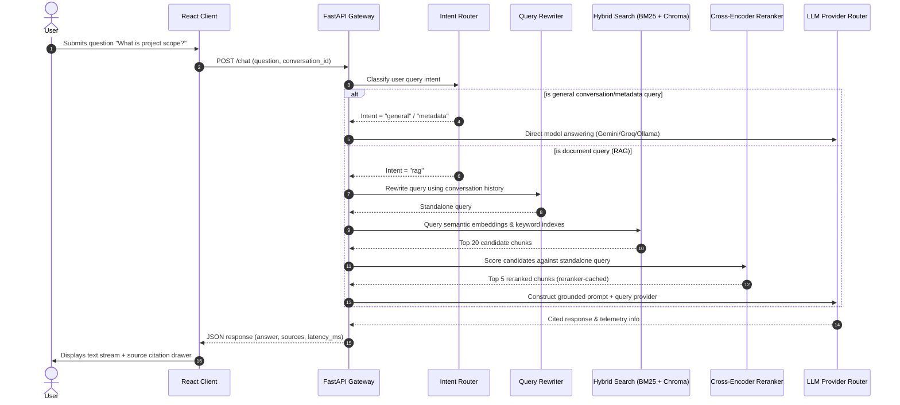

# AI Knowledge Chatbot (Atlas)

Atlas is an enterprise-grade, production-ready retrieval-augmented generation (RAG) chatbot platform built with FastAPI, SQLite, ChromaDB, and React (Vite). It provides grounded, cited answers using files uploaded to a local knowledge base.

---

## 1. System Architecture & RAG Flow

The diagram below details the data flow from user input to cited response:



### Core Pipeline Details
1.  **Intent Classification**: Inspects query syntax to identify database metadata inquiries, greetings, or corpus content queries.
2.  **Conversational Query Rewriting**: If context depends on earlier turns, Gemini rewrites the prompt into a standalone query.
3.  **Hybrid Lexical & Semantic Retrieval**: Interleaves semantic hits from ChromaDB (with local BAAI embeddings) and keyword scores from a custom BM25 index.
4.  **Cross-Encoder Reranking**: Evaluates candidates using the `ms-marco-MiniLM-L-6-v2` cross-encoder.
5.  **Multi-LLM Provider Failover Router**: Sequentially attempts answers through Gemini, Groq, and Ollama (local) to gracefully recover from 429 quota limits or 503 timeouts.
6.  **Bounded Caching**: Implements LRU caching for query embeddings (`maxsize=1024`) and Cross-Encoder pair scoring (`maxsize=8192`) to bypass expensive inference for repeated requests.

---

## 2. Environment Variables (`.env`)

Configure the following variables in `backend/.env`:

```env
# FastAPI Settings
DEBUG=True
LOG_LEVEL=INFO
ALLOWED_ORIGINS="http://localhost:5173,http://127.0.0.1:5173"

# LLM Providers Configuration
GOOGLE_API_KEY="your-google-api-key"
GEMINI_MODEL="gemini-3.5-flash"

GROQ_API_KEY="your-groq-api-key"
GROQ_MODEL="llama3-8b-8192"

OLLAMA_API_URL="http://localhost:11434"

# Storage Settings
DATABASE_URL="sqlite:///knowledge_chatbot.db"
CHROMA_DB_PATH="./chroma_db"
UPLOAD_FOLDER="./uploads"
```

---

## 3. Getting Started

### Backend Setup
1.  Navigate to the backend directory:
    ```bash
    cd backend
    ```
2.  Create and activate a virtual environment:
    ```bash
    python -m venv venv
    # Windows
    .\venv\Scripts\activate
    # macOS/Linux
    source venv/bin/activate
    ```
3.  Install dependencies:
    ```bash
    pip install -r requirements.txt
    ```
4.  Launch the development server:
    ```bash
    uvicorn app.main:app --host 127.0.0.1 --port 8001 --reload
    ```

### Frontend Setup
1.  Navigate to the frontend directory:
    ```bash
    cd ../frontend
    ```
2.  Install dependencies:
    ```bash
    npm install
    ```
3.  Launch the Vite development server:
    ```bash
    npm run dev
    ```

---

## 4. Running Backend Tests

Backend tests are configured to run inside the isolated `tests/` directory to avoid executing workspace scratch scripts.

To run the pytest suite:
```bash
cd backend
# Windows
.\venv\Scripts\python.exe -m pytest
# macOS/Linux
python -m pytest
```

The test suite covers:
*   CORS origin checks and preflight responses.
*   Document deletion chunk synchronization (successful and failed transactions).
*   Embedding query caching hits and hit-rate dynamics.
*   Cross-Encoder pair scoring caching hits and batched prediction paths.
